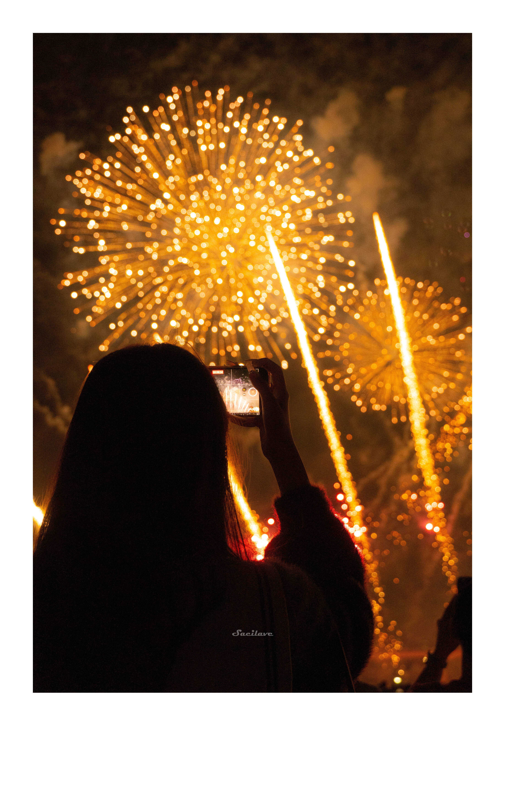

# Polaroid Style Generator

一个处理图片的工具，给图片添加拍立得边框（或等距边框和无边框），以及多种复古和艺术效果风格

## 目录
> ！使用者直接看 [使用方法](#五使用方法)
- [一、安装说明](#一安装说明)
- [二、项目结构](#二项目结构)
- [三、功能特性](#三功能特性)
  - [框架样式](#框架样式)
  - [色彩效果](#色彩效果)
    1. 复古效果
    2. 黑白胶片
    3. 即时显影
    4. 交叉冲洗
    5. 电影胶片
    6. 复古彩色
  - [处理特点](#处理特点)
- [四、内置图片压缩工具](#四内置图片压缩工具)
- [五、使用方法](#五使用方法)
- [六、技术实现](#六技术实现)
  - [核心类](#核心类)
  - [扩展性设计](#扩展性设计)
- [七、维护说明](#七维护说明)
  - [添加新框架](#添加新框架)
  - [添加新色彩效果](#添加新色彩效果)
  - [代码规范](#代码规范)
- [八、贡献指南](#八贡献指南)
- [九、命令行使用](#九命令行使用)
- [十、License](#十license)

## 一、安装说明

### 1. 下载项目
```bash
# 克隆项目
git clone https://github.com/sacilave/polaroid-style-generator.git

# 进入项目目录
cd polaroid-style-generator
```

### 2. 环境要求
- Python 3.6 或更高版本
- pip (Python包管理器)

### 3. 安装依赖
```bash
# 使用 pip 安装所需的包
pip install -r requirements.txt

# 或者直接安装必需的包
pip install Pillow==10.0.0
pip install numpy==1.24.3
```

### 4. 创建必要的目录
```bash
# 创建输入输出目录
mkdir -p images/input images/output
```

### 5. 准备图片
- 将要处理的图片重命名为 `input.jpg`
- 将图片放入 `images/input/` 目录

### 6. 运行程序
```bash
# 基本使用（使用拍立得框架）
python main.py -f polaroid

# 查看帮助
python main.py --help
```

## 二、项目结构

```
GalleryPicProcessor/
├── main.py              # 主程序入口
├── image_enhancer.py    # 图片处理核心类
└── images/              # 图片目录
    ├── input/           # 输入图片目录
    └── output/          # 输出图片目录
```

## 三、功能特性

### 框架样式
- `original`: 无框架，保持原始尺寸
- `polaroid`: 经典拍立得框架（底部加宽）
- `symmetric`: 对称边框（四边等宽）

### 色彩效果
 |  |  |  |
 |:---:|:---:|:---:|
 | **原效果**<br>无任何滤镜效果<br> | **vintage**<br>经典复古褪色效果<br> | **bw_classic**<br>经典黑白效果<br> |
 | **bw_high_contrast**<br>高对比度黑白<br> | **bw_soft**<br>柔和黑白<br> | **instant_70s**<br>70年代风格（偏绿）<br> |
 | **instant_80s**<br>80年代风格（偏暖）<br> | **instant_90s**<br>90年代风格（自然）<br> | **cross_process**<br>标准交叉冲洗<br> |
 | **cross_light**<br>轻度交叉冲洗<br> | **cross_strong**<br>强烈交叉冲洗<br> | **cinematic_kodak**<br>柯达风格（暖色调）<br> |
 | **cinematic_fuji**<br>富士风格（清爽）<br> | **cinematic_vision3**<br>Vision3风格（自然）<br> | **retro_60s**<br>60年代风格（高饱和）<br> |
 | **retro_70s**<br>70年代风格（偏黄）<br> | **retro_80s**<br>80年代风格（偏红）<br> | |

### 处理特点
- 框架和色彩效果可自由组合
- 保持原图分辨率不变
- 高质量图片输出
- 细腻的颗粒感效果
- 独特的色彩处理

## 四、内置图片压缩工具

### 方法一、

[点击看直接使用的指令](#压缩图片)

### 方法二、

先在 `compress_images.py` 中设置要压缩的目录，然后运行脚本：

```python
dir = " "  # 引号内填入要压缩的图片目录
compress_images(dir)
```

```bash
# 然后运行压缩脚本
python compress_images.py
```

压缩工具特点：
- **！注意 ！会直接覆盖原图，记得提前备份！！！**
- 支持 JPG、JPEG、PNG 格式
- 自动将 PNG 转换为 JPEG 以获得更好的压缩效果
- 可调节压缩质量（默认70%）
- 保持原始文件名和位置
- 优化文件大小

## 五、使用方法

1. 准备工作
   - 确保已安装 Python 3.x 版本
   - 正确安装项目查看 [一、安装说明](#一安装说明)

2. 放置图片
   - 将要处理的图片命名为 `input.jpg`
   - 放入 `images/input/` 目录

3. 运行程序
   查看 [九、命令行使用](#九命令行使用)

4. 查看结果
   - 处理后的图片将保存在 `images/output/` 目录
   - 输出文件名格式会是：`框架_色彩.jpg`
   - 例如：`polaroid_vintage.jpg`

## 六、技术实现

### 核心类
- `StyleProcessor`: 样式处理器基类
- `PolaroidStyle`: 拍立得框架实现
- `SymmetricPolaroidStyle`: 对称框架实现
- `BWFilmStyle`: 黑白胶片效果
- `InstantStyle`: 即时显影效果
- `CrossProcessStyle`: 交叉冲洗效果
- `CinematicStyle`: 电影胶片效果
- `RetroColorStyle`: 复古彩色效果
- `ImageEnhancer`: 图片增强器主类

### 扩展性设计
- 采用抽象基类设计
- 框架和色彩效果分离
- 支持轻松添加新的处理器
- 灵活的参数配置系统

## 七、维护说明

### 添加新框架
1. 在 `image_enhancer.py` 中创建新的框架处理器类
2. 继承 `StyleProcessor` 基类
3. 实现 `process` 方法
4. 在 `ImageEnhancer.frame_processors` 中注册

### 添加新色彩效果
1. 在 `image_enhancer.py` 中创建新的色彩处理器类
2. 继承 `StyleProcessor` 基类
3. 实现 `process` 方法
4. 在 `ImageEnhancer.color_processors` 中注册

### 代码规范
- 遵循 PEP 8 编码规范
- 保持类和方法的单一职责
- 添加适当的注释和文档字符串
- 使用类型提示增强代码可读性

## 八、贡献指南

欢迎提交 Pull Request 或 Issue，建议遵循以下原则：
- 保持代码风格一致
- 添加必要的测试
- 更新相关文档
- 提供效果示例

## 九、命令行使用

> 命令行怎么打开应该不用说了吧，如果真不知道... 上网搜搜吧孩子 (´。＿。｀)

#### 基础使用
```bash
python main.py -f [frame] -e [effect]  
```
    参数说明：
    frame: polaroid（拍立得）, symmetric（对称边框）, original（原始）; 
    effect: 
        不填：原色效果
        vintage（复古）, 
        bw_classic（经典黑白）, 
        instant_70s（70年代即时）, 
        cinematic_kodak（电影胶片柯达）, 
        cinematic_fuji（电影胶片富士）, 
        cinematic_vision3（电影胶片Vision3）, 
        retro_60s（60年代复古）, 
        retro_70s（70年代复古）, 
        retro_80s（80年代复古）, 
        cross_process（交叉处理）, 
        cross_light（轻度交叉处理）, 
        cross_strong（强烈交叉处理）

#### 使用拍立得框架生成原始效果
```bash
python main.py -f polaroid
```

#### 生成拍立得框架下的指定效果组合
```bash
python main.py -f polaroid -e vintage bw_classic instant_70s
```

#### 生成拍立得框架下的所有色彩效果
```bash
python main.py -f polaroid -ae
```

#### 生成5个随机组合
```bash
python main.py -r 5
```

#### 生成所有可能的组合
```bash
python main.py -a
```

#### 压缩图片
```bash
# 压缩指定目录下的图片（会提示输入目录路径）
python main.py -c

# 直接指定要压缩的目录
python main.py -c path/to/directory

# 指定压缩质量（1-100）
python main.py -c path/to/directory -q 80
```

## 十、License
This project is proprietary software.
All rights reserved. See [LICENSE](LICENSE) for details.
Unauthorized copying, modification, distribution, or use is strictly prohibited.
